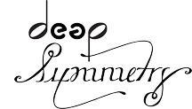

# lib-carabiner

Java wrapper for the
[Carabiner](https://github.com/Deep-Symmetry/carabiner#carabiner)
bridge to [Ableton Link](https://www.ableton.com/en/link/).

## Installing

lib-carabiner is available through Maven Central, so to use it in your
Maven project, all you need is to include the appropriate dependency.

Click the **maven central** badge above to view the repository entry
for beat-link. The proper format for including the latest release as a
dependency in a variety of tools, including Leiningen if you are using
beat-link from Clojure, can be found in the **Dependency Information**
section.

lib-carabiner uses [slf4j](http://www.slf4j.org/manual.html) to allow
you to integrate it with whatever Java logging framework your project
is using, so you will need to include the appropriate slf4j binding on
your class path.

It also uses [edn-java](https://github.com/bpsm/edn-java#edn-java) to
parse and build the Extensible Data Notation format messages used by
Carabiner.

## Usage

See the [API Documentation](http://deepsymmetry.org/lib-carabiner/apidocs/)
for full details, but here is a nutshell guide:

* TODO: Write this!

## Licenses

Copyright © 2020 [Deep Symmetry, LLC](http://deepsymmetry.org)

Distributed under the [Eclipse Public License
2.0](https://opensource.org/licenses/EPL-2.0). By using this software
in any fashion, you are agreeing to be bound by the terms of this
license. You must not remove this notice, or any other, from this
software. A copy of the license can be found in
[epl-2.0.md](https://github.com/Deep-Symmetry/afterglow/blob/master/epl-2.0.md)
within this project.

The included copies of Carabiner are distributed under the [GNU
General Public License, version
2](https://opensource.org/licenses/GPL-2.0). A copy of the license can be found in
[gpl-2.0.md](https://github.com/Deep-Symmetry/afterglow/blob/master/gpl-2.0.md)
within this project.
